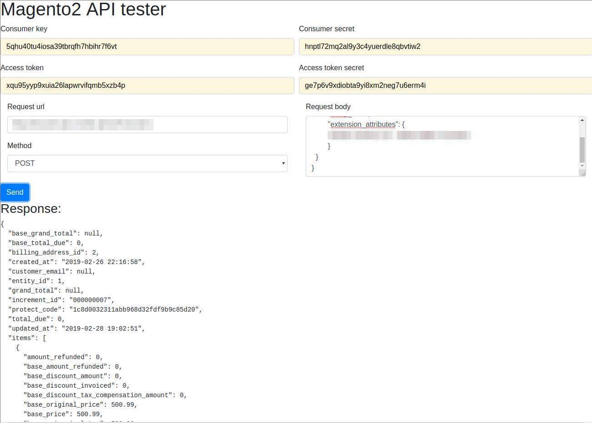

# Magento2 API tester example using OAuth 

#### First run:
 `composer install`

Follow instruction from: https://inviqa.com/blog/magento-2-tutorial-overview-web-api (Setting up an Integration) to get required params
### Run app
in project directory run:

`php -S localhost:8000`

Then open your browser on http://localhost:8000/ and you should see:

